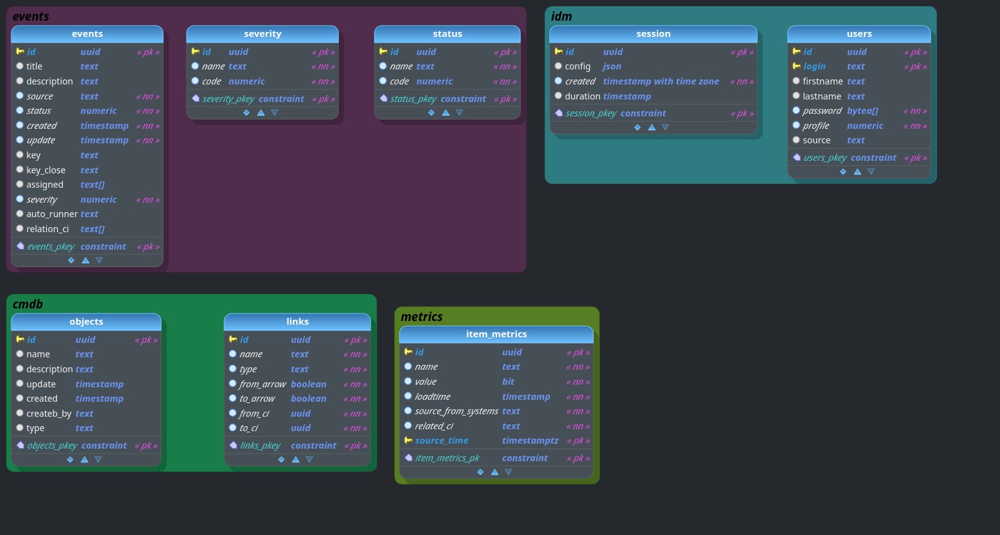

# **Техническое задание**
----------
## **Система зонтичного мониторинга**
----------
### **Общие требования**
>
- Система представляет собой комплекс сервисов для получения, обработки, хранения и предоставления информации      мониторинга.
>
- Система зонтичного мониторинга (СЗМ) - система, позволяющая получать от различных источников информацию по событиям мониторинга, метрическим данным и конфигурационным элементам (КЕ/CI). 
>
- В независимости от источника, информация хранится в СЗМ, приведенная к единому формату. СЗМ содержит необходимую информацию для определения источника информации.
>
- Система предоставляет интерфейс, на который системы поставщики могут отправлять данные в согласованном формате.
Система предоставляет интерфейс, через который потребители могут получать агрегированную информацию (например, метрики по определенному серверу, или события по определенному серверу).
Взаимодействие между сервиса происходит по бинарному протоколу (gRPC). Взаимодействие с пользователями происходит по протоколу HTTP.

### **Типы хранимой информации**
----------
>
К типам, которые обрабатывает система, относятся:

    • Учетные данные поставщиков;
    • Учетные данные потребителей;
    • Метрические данные;
    • События мониторинга;
    • CI
----------
>
Абстрактная схема взаимодействия с системой
>
Примерная схема взаимодействия с сервисом для поставщика:
    
    1. Поставщики авторизуются в сервисе;
    2. Поставщики отправляют данные (CI/События/Метрики) по протоколу HTTP.
>
Примерная схема взаимодействия с сервисом для потребителей:
    
    1. Потребители авторизуются в сервисе;
    2. Потребители выполняют запрос по протоколу HTTP к системе для получения агрегированного набора данных (например, все события со статусом Critical, все события на сервере не старше одного дня)1;
    3. Система возвращает потребителям набор запрошенных данных.

### **Схема БД**
> 
